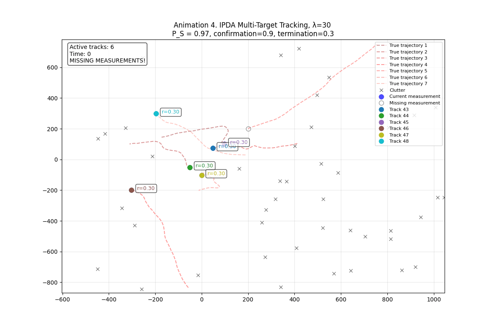

# Multi-Target-Tracking-and-Bayesian-Filtering
This project explores simulation and tracking of multiple moving targets using Bayesian filtering techniques.  Implemented in Python using Kalman, PDA, IPDA, and PHD filters, with animated visualizations in Google Colab.

## 🧠 Features
- Multi-target simulation in 2D space
- Kalman Filtering for single-object tracking
- Probabilistic Data Association (PDA & IPDA)
- PHD Filter implementation
- Animated plots using matplotlib

## 📚 Technologies
- Python
- NumPy, SciPy
- Matplotlib (for visualization)
- Jupyter Notebook (Google Colab)
- 
## 📽️ Preview
 

## ⚙️ Setup
```bash
git clone https://github.com/yourusername/multi-target-tracking.git
cd multi-target-tracking
pip install -r requirements.txt
```

## 📄 License

This project was developed as part of a university assignment at CTU in Prague (2025).  
All code is original and intended for educational and demonstrative purposes only.  
Please do not reuse for academic submission without proper attribution.

© 2025 Lidiia Pylyp. Released under the MIT License.
